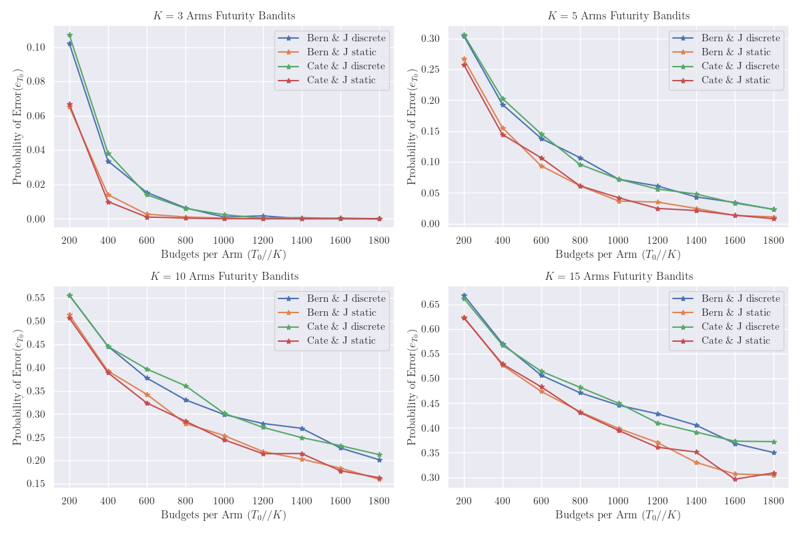
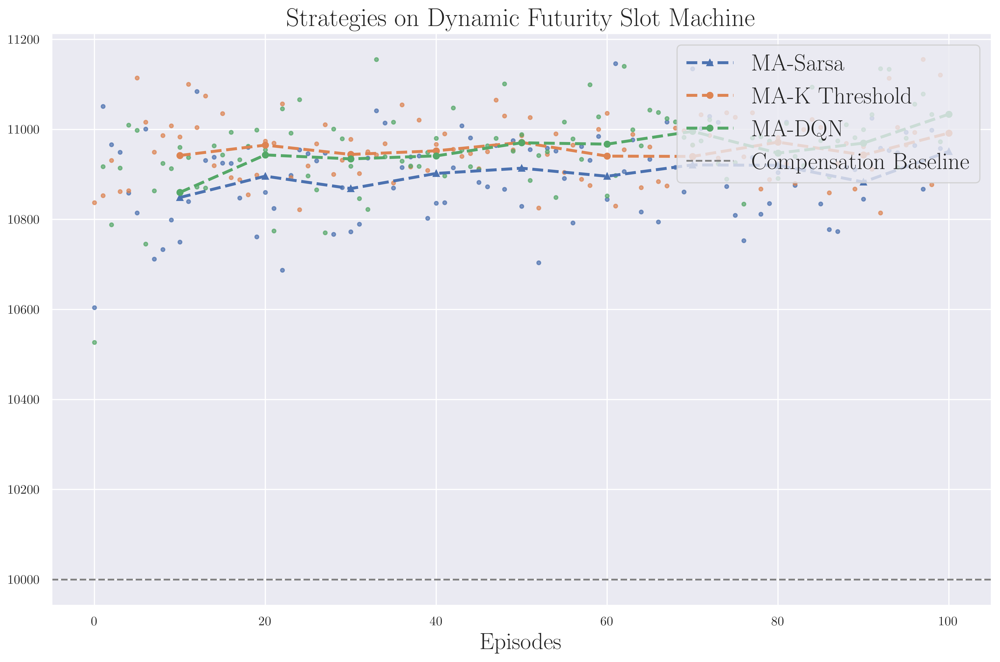

# RL-Futurity Slot Machine
Fair Futurity Slot Machine Design & Best Arm Identification & Optimal Policy

## 1.Design One-arm Fair Bandit
*Static Compensation :*

Futurity Mechanism J keep static in long run

*Dynamic Compensation :*

Futurity Mechanism J sample from a set/distribution
and adapt one-arm $\mu$ to satisfy asymptotic fairness 
     
    Random Sampling:
    1. J oscillates between 3 and 5, limited, using the chain-splitting method. The two chains are fair and asymptotically stable, so the expected reward is also 0.
    2. J follows a discrete distribution, e.g., the number of zeros in a sequence or a set of natural numbers. Is it still fair? (Sampling method)
    3. J follows a continuous distribution? It seems difficult to prove that the asymptotic expectation equals 0, e.g., Chi-squared distribution, due to its bias.

## Best Arm Identification - RHE
*Fixed-budget Setting* :
Error rate upper bound satisfy
$$
e_{T_0} \leq 2K\exp\left(-\frac{T_0\Delta_{i^*}^2}{2K} \right)
$$

## Optimal Policy based on K threshold/Sarsa/DQN

